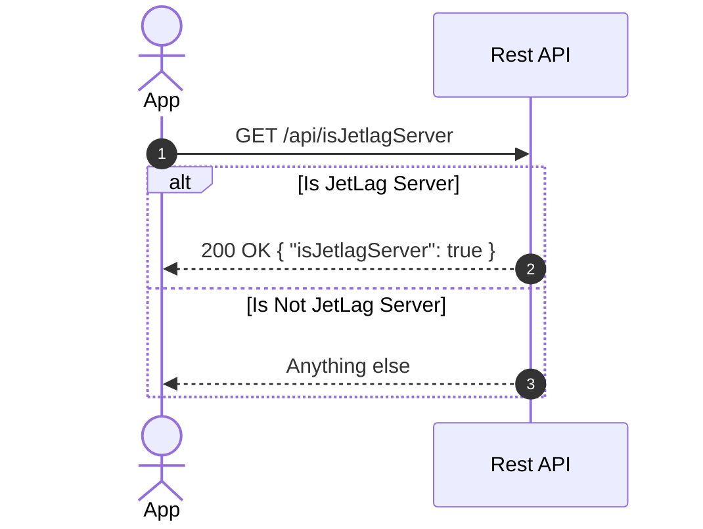
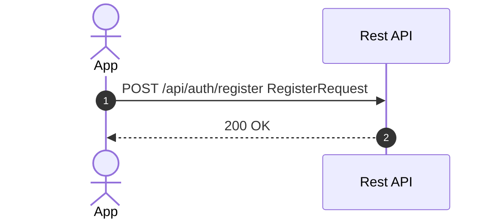
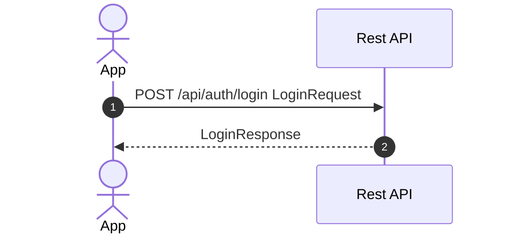
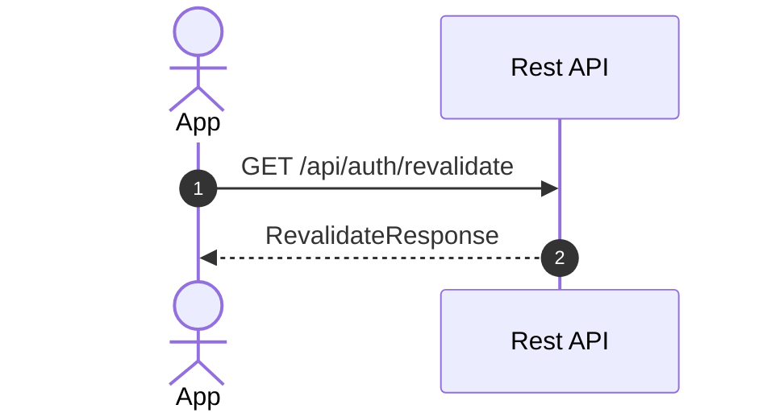

# Authentication Flow

## 1. Verify user provided server URL

- Does not require authentication
- Do that only when the user changes the server URL

## 2. Register

- Does not require authentication

[`RegisterRequest`](../packages/shared-types/src/restAPI/auth.ts)

## 3. Login

- Does not require authentication

[`LoginRequest`](../packages/shared-types/src/restAPI/auth.ts), [`LoginResponse`](../packages/shared-types/src/restAPI/auth.ts)

### 4. Revalidate Token

[`RevalidateResponse`](../packages/shared-types/src/restAPI/auth.ts)
