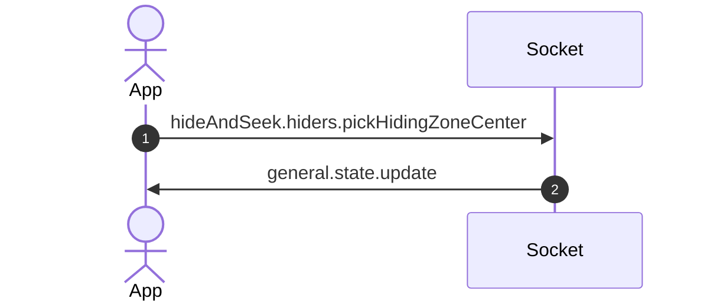
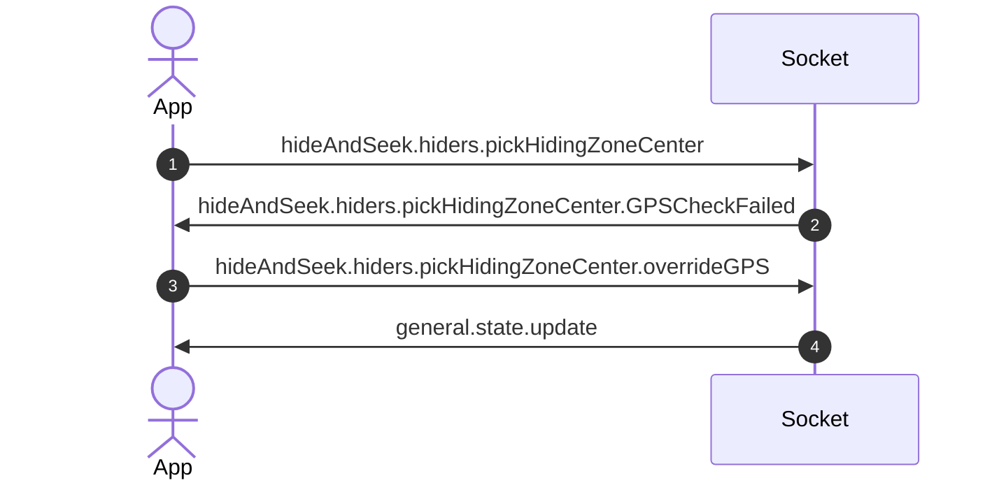
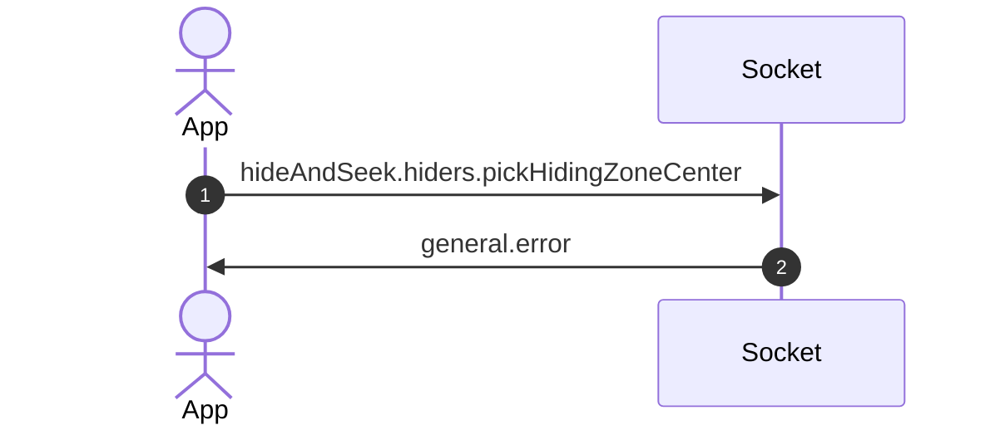

# Hide and Seek - Hiding Phase

- Starts when the game begins and ends after the hiding time limit is reached.
- Can be determined by state.gamePhase being equal to "hiding".

## Types

- [`ServerToClientEvents`](../../packages/shared-types/src/socket/index.ts)
- [`HideAndSeekClientToServerEvents`](../../packages/shared-types/src/socket/hideAndSeek.ts)
- [`HideAndSeekServerToClientEvents`](../../packages/shared-types/src/socket/hideAndSeek.ts)

## Picking a hiding zone center

- If none picked during the hiding phase, the game will:
    1. Attempt to pick the closest zone center to the hider team position
    2. If that fails, it will pick a random zone center from the dataset.
    - Hiders will be notified that this has happened via a `general.notification`.

### Successful hiding zone center pick

### Unsuccessful hiding zone center pick (GPS check fails)

### Hiding zone center pick fails (other reasons)

