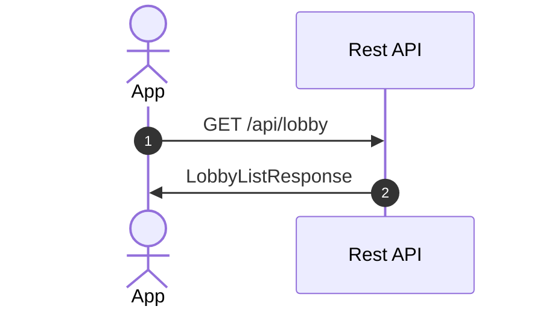
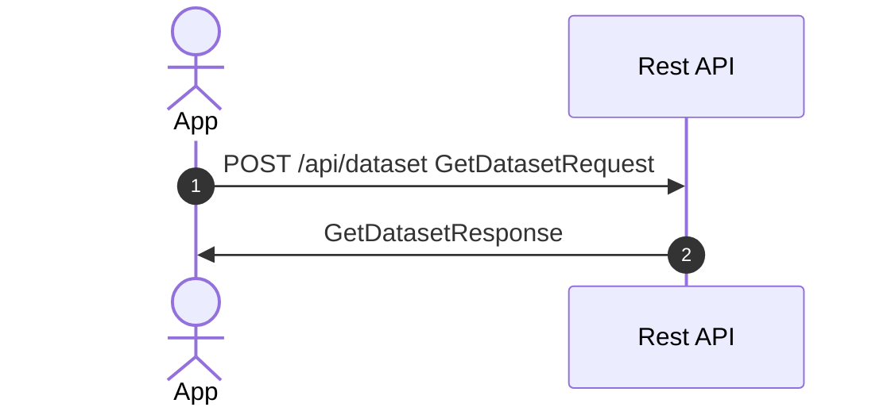

# Lobby

## 1. List available games

[`LobbyListResponse`](../packages/shared-types/src/restAPI/lobby.ts)

## 2. Download datasets

- for all available games, if the dataset is not already downloaded, download it
- pay attention to the difference between metadataId (shared between all
  versions, tied to the name) and datasetId (unique for each version)

[`GetDatasetRequest`](../packages/shared-types/src/restAPI/dataset.ts), [`GetDatasetResponse`](../packages/shared-types/src/restAPI/dataset.ts)
