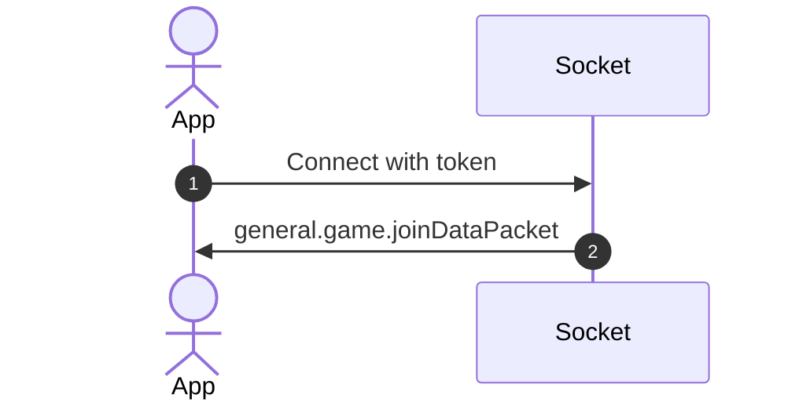
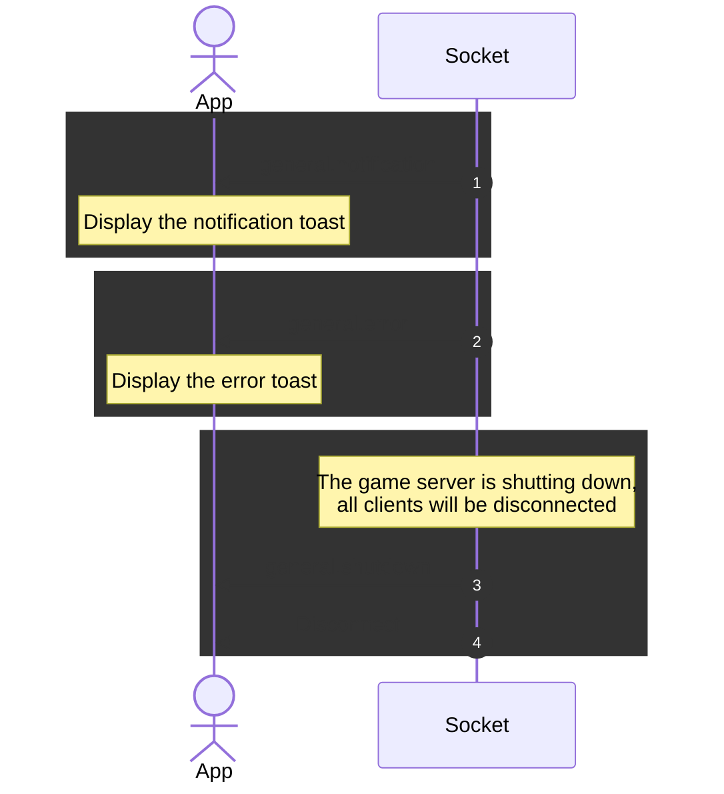
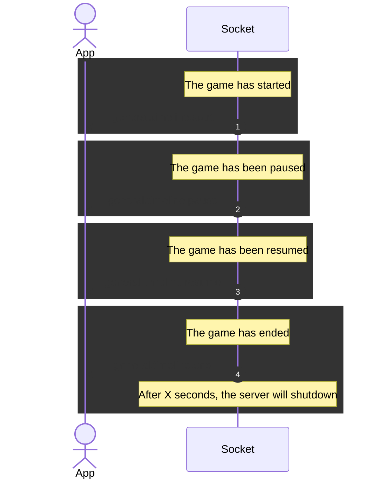
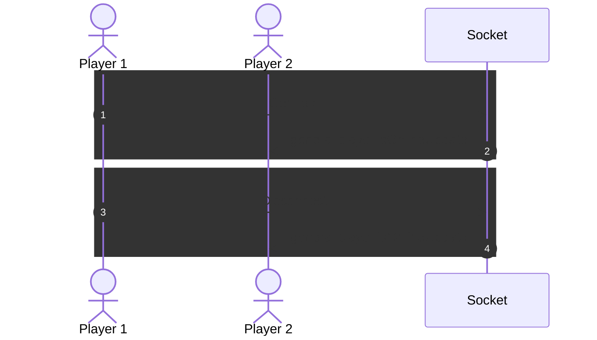
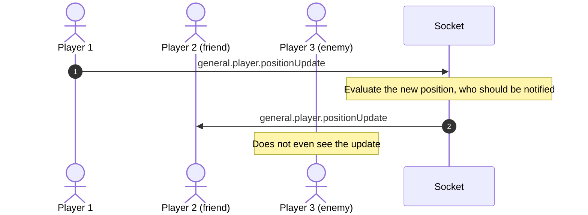
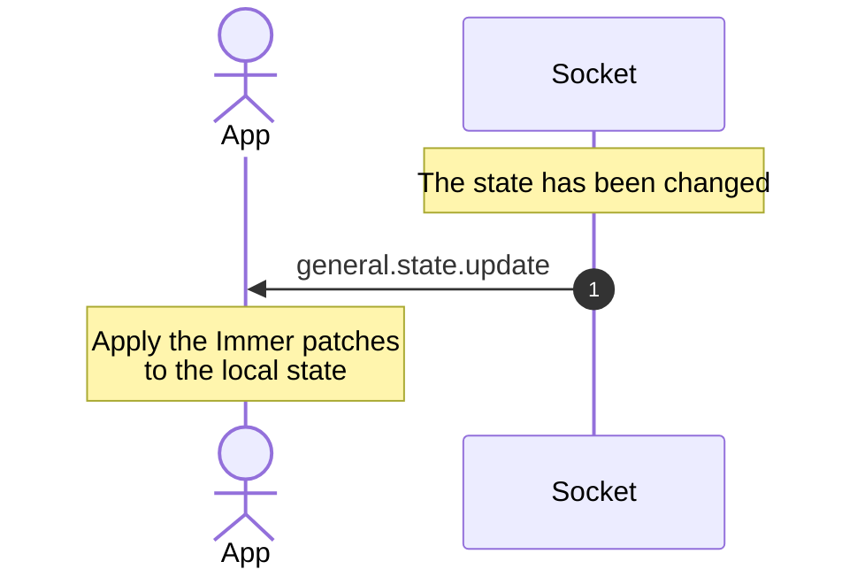

# Socket

Types: [`ClientToServerEvents`](../packages/shared-types/src/socket/index.ts), [`ServerToClientEvents`](../packages/shared-types/src/socket/index.ts)

## 1. Connection, authentication

- The authentication token is in the following format: `{Game ID}:{Auth Token}` (for example: `12345:abcde`) and must be passed in the socket.io's `handshake.auth.token` field.
- In case the token is not provided or is invalid, the connection will be terminated. Server logs will provide more details.

## 2. Notifications/errors

- General purpose events used to notify the user of various events
- Do not need to be persisted in any way, just display them

## 3. Timeline

- Events synchronizing the game time, state.

## 4. Player online state

## 5. Player position updates

## 6. State changes

